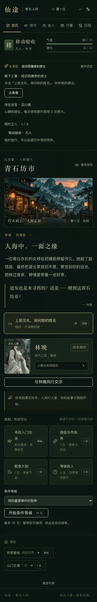

# 维护性、规模与移动端改进验收

日期：2026-09-07。分支：`codex/maintainability-scale-mobile`。本轮从 V0.1 候选提交 `1fe5a23` 继续，代码与回归收尾提交为 `f8cee15`。改动已本地提交，未推送或部署。原站点身份、玩家创角与官方内容锁保持不变。

本轮完成评审中的工程拆分、数值共用、短期存档压缩、Worker 批量推进、AI 路由修复、脚手架清理，以及移动端信息、反馈、摘要、条件推进、历程、关系趋势、图片和新手定位。存档选择短期方案；完整 seed＋命令日志事件溯源尚未实现，见下文边界。

## 交付内容

| 评审问题 | 当前实现与验证 |
| --- | --- |
| 压缩风格代码难维护 | Prettier 纳入 `verify`；`9739b70` 是独立纯格式化提交。引擎拆成 rng、worldgen、daily-simulation、combat、agreement、story、validate 等模块，`engine.ts` 保留公共出口，命令使用类型化处理器表。 |
| 主界面和官方引导耦合 | 拆出 JourneyTab、CharacterSidebar、SettingsDialog、LootSettlement、JournalPanel、RetreatSummary 等组件；通用目标解析器读取官方包 `ui-presentation.json`。前三个目标定位、高亮并聚焦实际控件。 |
| 数值与 UI 不一致 | `balance.json` 共用商品价、劳务、战利品、敌人、修炼／突破、恢复与时间成本，经济和行动成本有统一入口；测试渲染真实行囊组件，并断言其展示价格等于引擎扣款。AI 标准条款的路费／数量也从同一来源生成。 |
| 存档持续膨胀 | schema 5 按事件索引压缩知情元组，完整回执最多 128 条，旧回执进入累计校验链，保留精确历史命令 ID；导出紧凑 JSON。旧档副本迁移、原档备份及重复保护保留。 |
| 长行动往返和全状态渲染 | Worker 接受一次最多 30 日的 `advance`，逐日保存后发轻量进度，结束返回一次完整世界；主线程不再逐日发送 `step`。按日事务仍保留。测试验证批量结果与单步一致、暂停、部分重试边界、支付失败及丢失最终响应。 |
| AI 全站共享额度／反代 Origin | 路由从签名匿名会话或显式可信 CF IP 取限流 key，各 6 次／分钟；公开部署使用配置的完整 Origin 白名单。已测独立额度、签名重用、可信头开关及反代内部 URL。界面与文档明确只有一套标准同行条款。 |
| 模板残留和 CSS | 独立清理提交 `f8f32e9` 删除 D1／Drizzle 示例、未用绑定、15 项未用直接依赖和 52 个 UI 组件；保留 9 个组件与站点部署适配。补显式 `esbuild`、`sharp` 依赖，收窄 Tailwind 扫描并保留动画／减少动效样式。 |
| 错误只能匹配中文 | 规则拒绝统一使用带 code 的 GameError；普通资格／资源拒绝显示灰色提示，协议／存储冲突显示错误和重新读取入口。 |
| 移动端缺钱、目标、队伍和法宝 | 900px 以下使用可折叠状态条，收起也显示灵石和当前目标；展开含同行、法宝和目标定位。390px 目视核验，320px／200% 字体／图片失败回归通过。 |
| 结果太靠下、闭关信息淹没 | 已保存结果出现即时 toast，同时保留结果条；行动结束／重要近况暂停展示“闭关期间”，按人物列出玩家已知的重要变化，不只取最后 3 条。 |
| 时间成本和停止条件 | 行动统一使用时间徽标，零耗时为“即刻”、战斗为“1 回合”；支持修炼至圆满、等指定故人到达、重要事件暂停，单批最多 30 日。 |
| 技能槽、历程、关系缺提示 | 未开放槽位明确标注；历程按人物／类型／年份筛选、按年分组，每页 50 条，标记上次查看后新增；共同经历记录实际好感／信任变化方向，上限不误报，旧事件不推测。 |
| 图片太大、首次离线装全图集 | 九张 WebP 展示衍生图约 1.36 MB，保留原 PNG 画稿与模板；图片有固有宽高，NPC 懒加载。PWA 核心只含三张场景／主立绘，六张 NPC 图集按需缓存。 |

## 实测结果

以下 MB／KB 按十进制，均为未压缩 HTTP／JSON 字节；性能是本机单次观测，不是跨设备保证。

| 指标 | 改进前 | 当前 |
| --- | --- | --- |
| 9 张展示图片 | 23,226,882 字节原 PNG（约 22.15 MiB） | 1,364,516 字节 WebP，减少 94.1% |
| CSS 产物 | 约 183 KB | 78,816 字节，约减少 57% |
| PWA 核心 | 首次缓存全部 PNG 图集 | 16 个 URL，已知静态字节 1,371,816；HTML 在安装时另取并原子缓存，图集按需 |
| 运行时直接依赖／lock 条目 | 24／885 | 11／774；lock 条目包括根记录，并非本机实际安装数 |
| 五份 100 NPC 十年档紧凑 JSON | 7.48–7.69 MB | 4.62–4.65 MB，减少约 38–40% |
| 同五份档案的实际下载格式 | 原缩进导出 11.07–11.39 MB | 当前紧凑导出 4.62–4.65 MB，减少约 58–59% |
| Chrome 十年档推进 30 日 | 上轮约 13 秒 | 3,095ms；完整旧档导入 1,082ms；界面计时最大间隔 71.5ms |
| Firefox 十年档推进 30 日 | 上轮 20,290ms | 6,072ms；完整旧档导入 1,154ms；界面计时最大间隔 81ms |

五个旧档 Seed 为 1、42、12345、20260906、987654321。迁移时逐条比较解码后的知情及来源，并核对人物、事件、关系、RNG 和游戏状态保持一致；副本迁移加比较每份 133–178ms。完整回执均为 128 条。

另以新引擎执行 200 NPC／365 个逐日命令，验证通过：7,472 个事件、57,124 条知情、3,713,766 字节存档、128 条完整回执和 365 个精确命令 ID，用时 14,055ms。**本轮没有重新执行五 Seed × 3650 日整组模拟**；旧报告 `final-stress.json` 仍标注 schema 4。本轮证据是五个真实旧档迁移、新 200 NPC 一年模拟，以及 Chrome／Firefox 导入十年档后实际继续 30 日。`verify` 内另有确定性与长世界规则回归。

## 验证记录

- 当前工作区 `npm run verify`：82 项测试全部通过，含 3 边界／HTTP、7 内容、5 扩展、7 AI、19 Worker 存储、5 回调、32 引擎、2 经济和 2 UI；格式检查、strict 类型检查与完整生产构建通过。
- 独立干净目录从 `git archive f8cee15` 解出，`npm ci` 成功，再运行完整 `npm run verify` 全部通过。生产核心指纹与工作区同为 `8772923add315e8bd667`，证明清理后未依赖工作区旧 node_modules 或生成图片。
- Firefox 完整 30 项浏览器测试全部通过，无跳过。包括真实 IndexedDB 中止／配额异常注入、第四个付费检查点故障、丢失最终 ack、旧档迁移及原件保留、AI mock 生命周期、手机、离线更新、大档和正常 UI 两条主线。
- Chrome 完整执行先得到 29 通过／1 失败；失败原因为测试尚未等待新闭关摘要出现就操作更新按钮。修正等待顺序后，离线 3 项、改进 3 项、两条主线 2 项复测全部通过。本轮 30 个不同场景均有通过记录，不将初次失败隐藏或计为通过。
- 390px 展开状态目视检查，钱／目标／法宝／同行可见；没有横向溢出或页面错误。桌面移动视口不替代真机。

结构化指标、命令、日志 SHA-256 与本机日志位置见 [maintainability-scale-mobile.json](maintainability-scale-mobile.json)。隔离测试存档不提交 Git，也未访问用户日常浏览器存档。



## 存档与部署边界

当前仍以 World 快照为存档真身。`knowledge` 为事件 ID 到 `[知情人物索引, 来源码, 来源人物索引, 得知日]` 元组列表，精确历史 `appliedCommands` 保留。累计回执哈希仅作审计校验，不能认证存档或证明某命令是否执行；没有完整载荷的历史 ID 拒绝重放。完整事件与命令 ID 仍增长，16 MiB 导入上限仍在。本轮解决体积和最近重试成本，未承诺无限存档年限。

完整事件溯源需另行实现命令载荷日志、规则版本重放、旧导入档的基线和全部 AI 确认输入，不能只保留现有命令 ID 就称为“seed＋日志”。云同步、KB 级全人生存档、防篡改和旧 bug 任意重放没有实现。

Worker 仍逐日 structuredClone／保存世界；优化的是主线程的逐日完整状态往返和渲染。每日 IndexedDB 事务保障最后成功检查点恢复。暂停当下已在计算的一日可以完成，界面等待保存确认后才说“已暂停”。

AI 限流表和匿名会话签名密钥为进程内状态；多实例共享配额、身份认证和防止反复新建匿名会话不在本轮实现。公开来源配置与可信 CF 头的部署要求见 [AI-CONFIG](../AI-CONFIG.md)。真实 AI 供应方、iPhone Safari、Windows Chromium、独立评审与外部试玩仍未执行。原本延期的金丹以上、完整亲密路线、宗门经营、多人和实时生图保持原范围。

## 复现入口

```bash
npm ci
npm run verify
npm run start:local -- --hostname 127.0.0.1 --port 3100
```

打开 <http://127.0.0.1:3100/>。重建后重启生产服务。已启动服务上执行浏览器测试：

```bash
PLAYWRIGHT_CHANNEL=chrome XIANTU_TEST_URL=http://127.0.0.1:3100 XIANTU_STRESS_OUTPUT=/tmp/xiantu-final-stress npm run test:browser:existing
PLAYWRIGHT_BROWSER=firefox XIANTU_TEST_URL=http://127.0.0.1:3100 XIANTU_STRESS_OUTPUT=/tmp/xiantu-final-stress npm run test:browser:existing
```

两个浏览器的离线测试共用更新代理端口 3125，按顺序执行。大档性能项要求指定目录中存在 `save-1.json`；新机器先用 `npm run test:stress` 生成，缺文件会明确跳过，不算大档验收通过。更完整的源码边界、协议、迁移和恢复说明见 [HANDOFF](../HANDOFF.md)。
