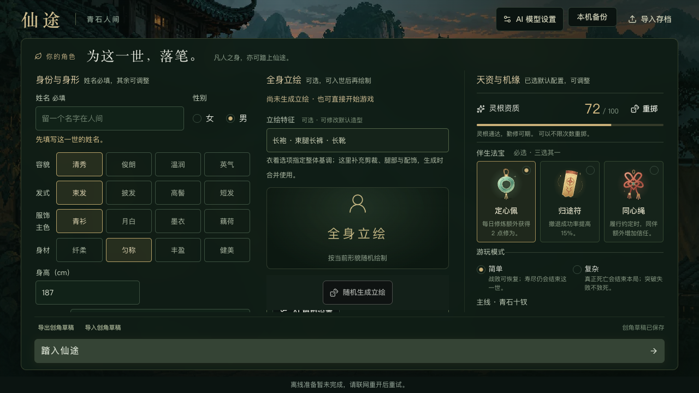
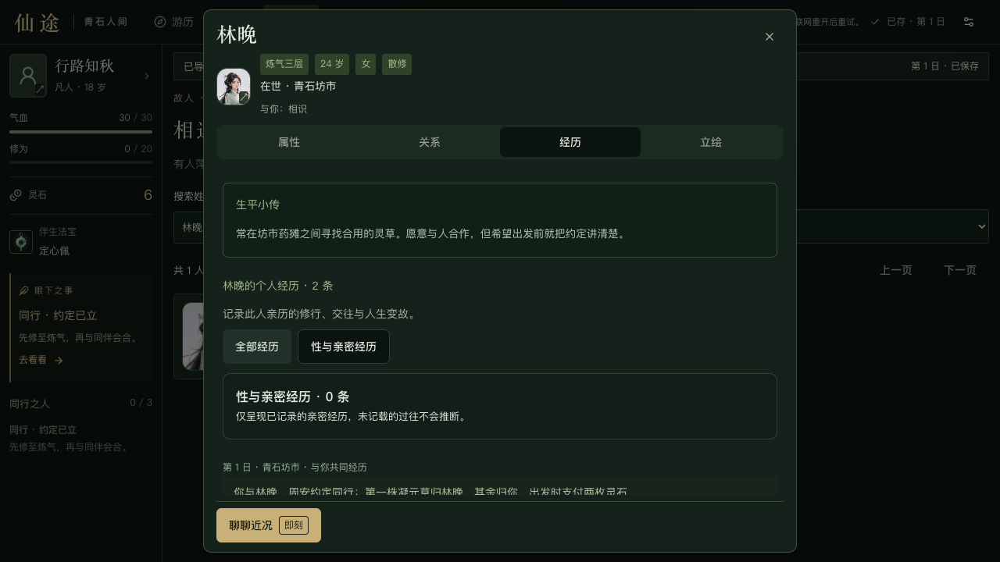
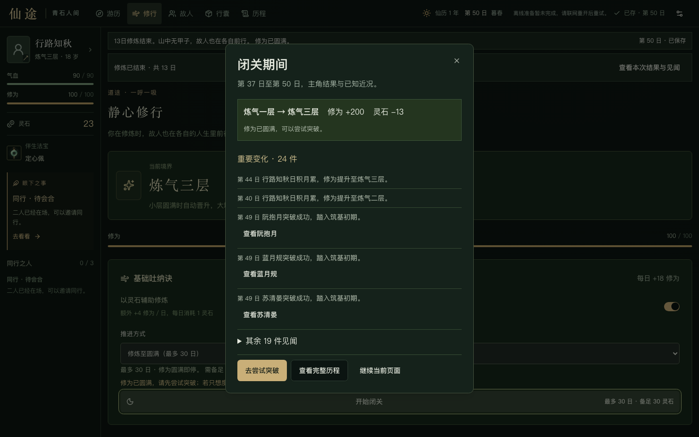
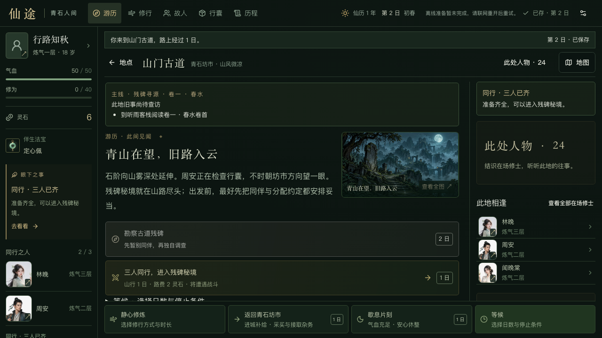

# 2026-09-08 UI 评审改进与交接

归档日期：2026-09-09。本轮依据完整 UI 评审的74条问题实施改进，主代理维护源码，三个子代理分别研究和复核游历成长、人物创角、设置与无障碍。当前 **68项已实施、6项部分完成**；逐项机器清单见 [issues.json](ui-review-2026-09-08/issues.json)。

“已实施”表示对应修改已落地并有相应范围的验证，不等于所有原建议、所有种子、素材、设备和供应商均验收通过。这里归档状态、代表截图及验证边界；完整原始评审、失败历史、浏览器探针和隔离夹具保留在项目外的本机评审目录，不作为运行依赖或冒充已随仓库交付。

## 按游玩流程的变化

1. 创建角色：姓名必填，输入回车不会误开局；18岁默认外貌与验证规则一致。AI设置可连续配置两套模型，生成、取消、采用与恢复状态明确；修改形貌保留旧图和草稿恢复选项。
2. 地点与剧情：地图按需呼出，当前对话优先于远方目标；提前到城显示具体缺项。右栏跟随当前故事人物，陌生人物先使用称谓；完整立绘不裁头脚，低高度下三条在场人物与全部入口可见。
3. 人物往来：列表可搜索、筛选、排序、分页；资料使用属性、关系、经历、立绘四页签，返回上一人保留阅读位置。见礼入口去重，确认写明对象、耗时与后果。
4. 成长与等候：修炼预算、按钮和提交同源，圆满即停；短等候不再弹出长篇闭关摘要，长行动保留原页签。摘要固定已保存收益并折叠大量事件，恢复旧档清理未来摘要。
5. 突破、同行与战斗：突破成本、失败风险、护法缺项与丹药来源明确；集合、返城、续约入口连续。移除无效技能槽，主角战报靠近操作；查看人物时暂停自动战斗。
6. 存档与设置：保存失败显示真实状态并阻止继续写入；明确失败可原请求重试，未知回执和跨页冲突先重读。恢复/替换写明角色与日数；删除个人模型配置须确认，关闭设置可保留配置。

## 实际验证

最终 UI 构建：`4220bdf35b9d1c16c50c`。2026-09-09 整理上传前再次执行 `npm run verify`；汇总见 [上传检查](GITHUB-SYNC-2026-09-09.md)。运行时源码与上一轮逐文件SHA-256记录一致，构建指纹也相同。

| 分组 | 实际证据 | 范围说明 |
|---|---|---|
| 游历与成长 | 26个功能用例 | 11个在08b复测，其余15个沿用c0构建未受影响的通过证据；不是26个全在最终构建重跑 |
| 图片与低高度 | 6个流程/尺寸组合 | b3的5个完整流程加4220的1个古道补测；b3的图片与右栏6组合均通过 |
| 人物与创角 | 10条主路径 | 08b构建；所有AI响应模拟，采用/恢复/取消核验世界边界 |
| 设置及无障碍 | 27项设置、5项颜色/键盘 | 08b构建；44个纯色背景样本达4.5:1以上，图片背景不作全量认证 |
| 真实浏览器存储故障 | 21项故障、8项跨页冲突 | c0构建的真实IndexedDB故障注入；不是仅JSON往返 |
| 主代理流程 | 10个用例 | b3构建，涵盖小于400ms连续操作、布局、履约、结局、离宗、离线更新 |
| 最终连续普攻补测 | 1个用例 | 4220构建，相隔约171ms两次有意普攻提交两次，同步双击只提交一次 |

各组计数单位不同，不累加为“全站独立流程数”。全部使用临时Chrome上下文/测试角色和本地AI模拟服务，不涉及真实玩家存档或真实模型请求。桌面1440×900、1280×720及部分1366×768通过所列检查；390×844/320×740仅视口模拟，不是实体手机、Safari、Windows或全缩放比例验收。

离线更新通过独立本机代理读取相同生产资产，仅在隔离来源切换Service Worker；Chrome重载时对navigator.onLine的重置已单独记录并重新施加离线状态。真实缓存、离线行动与刷新持久化均核对。原项目浏览器套件还包含旧流程/文案断言，本轮未声称整套旧浏览器测试全过。

## 未完成项与保留决策

- U-01：所有种子、长剧情的空间利用率尚未量化。
- U-10：已复现裁切修复，但120张图及全部模板未逐张重新验收构图。
- U-34：标准条款与模拟交涉通过，真实供应商成功率、延迟未实测。
- U-50/U-51：各宗门和郊野独立新场景图、六位门人的原画待制作；当前示意图和姓名占位如实显示。
- U-74：含背景图的文字对比仍需逐图复核；不宣称全站WCAG认证。
- 原附录B9：**危急自动撤退策略未接入**。当前自动选择只有丹药、技能和普攻，balance的20%气血及仅一人站立撤退条件无消费者；需单独落实玩家/NPC共用策略、规则版本和回归。教学遭遇默认非致命，不以弹窗暂停通过代替这项验收。
- 原附录其他边界：普通散修可按规则跨城择宗，固定剧情人物沿用驻地；不能承诺等候指定人物一定抵达。站点默认服务地址是否公开保留为产品决策。
- 模式名称“复杂”、默认种子12345及用户要求的默认造型保留原语义，并增加说明；没有把所有设计建议自动变成新规则需求。

## 74项逐条记录

| 编号 | 原级别 | 状态 | 问题 | 修改与边界 |
|---|---|---|---|---|
| U-01 | P1 | 部分完成 | 地点选择页只回答「我在哪」，不回答「现在做什么」 | 地点选择首屏显示当前故事、人物和下一步，可直达地点详情；极端内容长度的空间利用率仍待专门量化。 |
| U-02 | P1 | 已实施 | 右栏大卡硬编码为林晚，当前剧情对象与在场列表被挤出视口 | 右栏按当前故事切换人物；集合操作前移，完整立绘约束在容器内，全部在场入口前移到列表标题。 |
| U-03 | P1 | 已实施 | 右栏在结识前就报出林晚姓名，且「同行交涉」入口对陌生人可用 | 结识前使用人物称谓；陌生人交涉有明确前置，保留实际角色身份。 |
| U-04 | P1 | 已实施 | 目标系统单一覆盖：「眼下之事」与正文剧情、同行阶段互相拉扯 | 目标优先当前对话、战斗、战利品、长行动和约定阶段；主线就绪不再引导离场。 |
| U-05 | P2 | 已实施 | 「查看其余 N 人」在 180px 小窗内滚动，且撑开整页 | 全部在场人物使用正常弹窗；移除180px的小滚动框。 |
| U-06 | P2 | 已实施 | 地点卡标题即旅行按钮；「进入地点 / 前往·即刻 / 前往·1 日」三种含义同一样式 | 地点名称只展示位置；旅行由独立按钮执行并标成本。 |
| U-07 | P2 | 已实施 | 底部行动条与正文「条件等候」混排三种等待、两种「即刻」；「即刻」同时用于不写世界与写世界的动作 | 统一等候条件与时间控件；查看面板不再标耗时，写世界的零日命令保留即刻。 |
| U-08 | P2 | 已实施 | toast 与结果条重复、遮住顶栏页签 5 秒、弹窗打开时被遮罩盖住、弹窗内命令无可见结果 | 普通结果统一显示在操作区上方，人物弹窗内也显示保存结果；生图状态与动作同屏。 |
| U-09 | P2 | 已实施 | 地图弹窗：行程/条件在折叠区，符号不表达状态，低视口下启程按钮出视口 | 地图头尾固定；行程、条件与启程同屏，添加当前、主线、宗门、已查明图例。 |
| U-10 | P2 | 部分完成 | 场景图 / CG / 立绘容器裁切与留白，无查看全图入口 | 场景图可放大全图；修正网格最小尺寸和图片比例导致的裁切；全部历史模板仍需逐张构图复核。 |
| U-11 | P1 | 已实施 | 百人列表只能整页滚动，没有查找手段；伪按钮样式 | 人物列表新增搜索、范围、排序和分页；明确资料入口。 |
| U-12 | P1 | 已实施 | 「关系」页先放四个发起行动，查看关系需下滚一屏；禁用理由重复四次 | 先呈现人物关系，交往操作按需展开，合并重复拒绝原因。 |
| U-13 | P1 | 已实施 | 头部关系标签与列表标签矛盾（挚友 vs 道侣） | 头部与列表共用有向关系和双向道侣投影；旧单向已知关系继续兼容。 |
| U-14 | P2 | 已实施 | 好感 / 信任 / 吸引只有裸数字，阈值与变化不可感知 | 显示下一关系阶段缺口、吸引含义；仅对有真实记录的事件显示数值变化。 |
| U-15 | P2 | 已实施 | 陌生人可直接「相伴交流 1 日」，而底部主按钮是「上前见礼 即刻」 | 陌生人只保留底栏见礼入口，不用相伴资格错误限制见礼。 |
| U-16 | P2 | 已实施 | 资料弹窗固定 828px 高而内容区只有 411px，关键按钮全部在折叠线下；低视口下内容区缩到 246–290px | 人物弹窗压缩头部，内容独立滚动，主要动作固定；低高度四页签已实测。 |
| U-17 | P3 | 已实施 | 主角与 NPC 资料结构小不一致 | 统一人物属性/关系/经历/立绘结构；男性隐藏胸围，散修用可读文案。 |
| U-18 | P3 | 已实施 | 头像→立绘、姓名→属性的双入口没有可见提示 | 头像提供放大提示，姓名和资料按钮明确查看用途。 |
| U-19 | P3 | 已实施 | 「打听 / 其他修士」分组命名与内容不符；亲密筛选放在提示卡内，空态两段文案 | 人物范围文案更明确；经历筛选移到标题区域，保留未知经历不推断说明。 |
| U-20 | P2 | 已实施 | 重绘流程四个动作命名相近，失败/等待反馈位置不对 | 明确编辑/生成/待采用状态，恢复与保留动作分场景显示，失败与取消结果同屏。 |
| U-21 | P2 | 已实施 | 主角立绘页显示未选择过的体貌默认值，与创角设定冲突 | 新角色外貌默认与18岁初始年龄一致，创建/draft/立绘校验统一；旧存档已有体貌不改写。 |
| U-22 | P3 | 已实施 | 结侣 / 共修确认框缺耗时、收益与后果，且把玩家发起说成对方提议 | 亲密确认明确双方、耗时、收益、排他约束；结侣0日、共修1日均来自命令规则。 |
| U-23 | P1 | 已实施 | 「修炼至圆满」的日数、灵石、徽标来自三份不同数据 | 修炼日数、预算、按钮与提交使用同一预览；提前圆满只扣实际天数。 |
| U-24 | P1 | 已实施 | 修为已满仍可发起/继续按日闭关，且无任何提示 | 圆满状态拒绝条件修炼且不耗日、不扣资源；旧暂停圆满档不能继续空转。 |
| U-25 | P1 | 已实施 | 长行动生命周期：开始即强制切到游历、任何长行动结束都弹「闭关期间」摘要、关闭后无下一步、页签状态丢失 | 长行动保持当前页签；短等候不弹长摘要；摘要关闭后可定位突破准备。 |
| U-26 | P1 | 已实施 | 闭关摘要平铺所有已知事件，没有总览与主角结果，两人事件重复 | 摘要固定主角收益、类型、终止原因及已知事件，首屏前5项，其余折叠；旧档恢复清理未来摘要。 |
| U-27 | P2 | 已实施 | 突破准备区的成本、风险、禁用原因不足以决策；同一按钮出现两个日数 | 突破普通/严重失败风险量化；护法条件逐项列出，丹药购买与兑换同源并提供入口。 |
| U-28 | P2 | 已实施 | 筑基后的阶段终点只有一句话，修炼卡仍可空转耗日 | 筑基阶段卡说明本版上限，提供地图和故人入口；继续闭关被阻止。 |
| U-29 | P2 | 已实施 | 条件等候按钮禁用无原因；下拉可选「已在场」或「异城不会赶来」的人物 | 条件等候有原因和人物位置说明；NPC自主跨城能力保留，不修改模拟规则。 |
| U-30 | P2 | 已实施 | 行囊把「已拥有」「×0 占位」「药铺」平铺，禁用购买不说缺钱还是异地 | 行囊区分已拥有物品与商店，零库存不占卡；显示价格、持有量、缺款/地点和兑换条件。 |
| U-31 | P2 | 已实施 | 历程：类型下拉泄露内部键名、「新增」标记无信息量、空结果无一键恢复、分页只在底部 | 历程补全可读类型、仅看新增、重置筛选和顶部分页；主线记录可回看。 |
| U-32 | P1 | 已实施 | 同行「约定→集合→出发」三阶段没有稳定入口，组队后正文自相矛盾 | 约定/会合/组队/出发状态与入口连续；集合按钮固定在右栏靠前位置。 |
| U-33 | P1 | 已实施 | 替换类确认（新角色/导入/恢复）不核对对象，建议导出却没有导出入口，「创建新角色」把确认放在流程末尾 | 新建/导入/恢复确认列出替换双方、天数和模式，确认层可导出当前进度。 |
| U-34 | P2 | 部分完成 | 交涉入口在不可能成功的状态下仍可打开；「固定选项」指代不明；失败提示重复 | 交涉预检与标准续约分离；三人退回坊市可再次邀约，文字服务仍只支持标准条款。真实供应方本轮未验。 |
| U-35 | P1 | 已实施 | 撤退后约定静默作废，古道上的提示把玩家引向无效等待；出征禁用原因把三个条件混成一句 | 撤退后解释约定状态，提供有效返城/续约路线；出发缺项具体显示。 |
| U-36 | P1 | 已实施 | 一回合后，玩家自己的行动结果不在视口内；顶部提示只显示最后一名行动者 | 缩小战斗场景与空白，最新战报倒序、主角行动突出，动作与战报同屏。 |
| U-37 | P2 | 已实施 | 技能槽行重复显示「青芒剑诀」，三格「本版未开放」只占空间 | 移除三个永不开放的技能槽，保留真实剑诀冷却与丹药状态。 |
| U-38 | P3 | 已实施 | 战斗中打开队友资料：「聊聊近况」禁用无说明；自动战斗是否在弹窗打开时继续待验证 | 自动战斗打开人物弹窗即暂停，关闭后仍需手动继续；不可交谈原因可见。 |
| U-39 | P2 | 已实施 | 履约 / 独占的后果不对称、不具体 | 履约/独占都列实际资源与关系方向，履约实扣和所得已实测；违约仍需确认。 |
| U-40 | P1 | 已实施 | AI 设置说明与「生成立绘」的真实依赖矛盾；创角立绘区无前置提示 | 立绘区域和AI设置说明文字模型与生图模型的完整依赖，提供稳定设置入口。 |
| U-41 | P2 | 已实施 | 创角必填项与禁用原因不可见；文本框 Enter 直接开局 | 姓名必填和禁用原因可见，输入框Enter不误开局，嵌套设置提交不创建世界。 |
| U-42 | P2 | 已实施 | 立绘等待层叠影；生成中可提交并静默中止；改形貌静默丢立绘 | 生成/待采用不能误开局；形貌变更保留原图供决策，草稿刷新后仍可恢复原形貌。 |
| U-43 | P2 | 已实施 | 机缘种子无可见说明，默认全员相同 | 保留与现有原画配套的默认种子12345，明确重现含义及修改影响。 |
| U-44 | P3 | 已实施 | 创角三列无可见标题、必选/可选标注不统一；女性默认立绘特征与衣着选项冲突；「复杂」模式命名 | PC三列可见标题，必选/可选说明统一；服饰主色与造型补充说明明确，保留用户要求的默认造型及现有模式语义。 |
| U-45 | P1 | 已实施 | 提前到城但条件不足时，地点页无任何缺条件说明 | 提前到城可查看境界、前章、时间、人物与证据缺项；自由旅行不等于跳过剧情。 |
| U-46 | P2 | 已实施 | 「主线」眉题混用于残碑节点与十钗人物故事；主线完结无完结卡；足迹折叠且只有标题 | 残碑主线和人物故事眉题区分；完整主线日期、查证与最终选择进入回顾。 |
| U-47 | P3 | 已实施 | 结局二选一无后果说明 | 结局选择明确只有叙事记述差异，无资源差异；实际选择与回顾已核对。 |
| U-48 | P2 | 已实施 | 入门前看不到心法、每日加成、委托与报酬，三宗无法比较 | 入门前展示三宗特点、每日修炼加成、委托、报酬及心法成本。 |
| U-49 | P3 | 已实施 | 宗门面板细节：贡献与心法价格分离、「已习得」带时间徽章、离宗后果不全、门规不符不分永久/可变、誓约展开无焦点转移 | 贡献缺口和委托次数同屏，已习得为状态；离宗明确贡献清零和心法失效，誓约展开有焦点。 |
| U-50 | P3 | 部分完成 | 拜访反馈三处重复、底部栏与卡内按钮重复；郊野 / 宗门复用青石文案与通用图片 | 宗门行动与拜访反馈去重，郊野替代图标注为景致示意；尚未制作各地独立新原画。 |
| U-51 | P3 | 部分完成 | 宗门门人在「此地相逢」不优先且无头像；异城同伴约定块占据右栏 | 宗门门人优先，异城约定可折叠；六名新增门人仍为姓名占位，没有冒用其他人物画像。 |
| U-52 | P2 | 已实施 | 禁用按钮多数无原因；禁用态文字对比 2.3–3.5:1；闭关期间整页变灰无说明 | 禁用行为配原因，修复浅金按钮浅字；实际纯色背景样本达4.5:1以上，不宣称全站WCAG认证。 |
| U-53 | P2 | 已实施 | 金色主按钮上的时间徽标对比约 1.2:1 | 金色按钮徽标继承高对比文字，正常与禁用状态均测量。 |
| U-54 | P3 | 已实施 | 日数徽标重复、禁用按钮仍带徽标；文案与配置不同源 | 删重复日数；耗时命令从规则取值，导航不再使用时间徽标。 |
| U-55 | P1 | 已实施 | 「清除个人配置并关闭」语义错误、无确认、位置危险 | 清除配置使用明确对象的二次确认，取消保留密钥，关闭可保留个人配置。 |
| U-56 | P2 | 已实施 | AI 设置弹窗内容高于视口，底部动作被裁切且无滚动暗示 | AI设置单滚动主体与固定操作栏，低高度预览和按钮可见。 |
| U-57 | P3 | 已实施 | 测试按钮禁用无原因；页签不显示启用状态；作者预览共用会话配置未说明 | 测试前置和模型启用状态可见，作者预览共享浏览器会话配置明确说明。 |
| U-58 | P2 | 已实施 | 真实部署把站点默认服务的内网地址与模型 ID 填进可编辑字段 | 站点默认配置只读，与个人服务编辑分开；保留HTTP支持，不把公网地址误称内网。 |
| U-59 | P2 | 已实施 | AI 设置错误提示远离字段、无字段关联；超时提示指向折叠区 | 字段错误关联输入并聚焦，超时错误可展开高级项定位。 |
| U-60 | P2 | 已实施 | 设置弹窗把 AI、存档、新角色、备份、创作模板串成一列，1440×900 已需内滚；标题与入口名不一致 | 设置按这一世/新的一世/工具分组，备份和AI子页有明确返回。 |
| U-61 | P3 | 已实施 | 导出文件名无日期时间，同日重复导出同名；作者预览导出无标识 | 存档与草稿导出名称加入时间及用途，预览存档带标识。 |
| U-62 | P2 | 已实施 | 三层同尺寸弹窗叠放，底层内容从边缘露出，关闭后返回已滚动的父弹窗 | 设置子页替换同一层内容，危险替换只保留必要确认层，不堆三个同尺寸面板。 |
| U-63 | P2 | 已实施 | 备份列表无时间与来源，同名同日不可辨；恢复后无反馈 | 备份增加时间与来源元数据并同事务保存；旧备份无日期不伪造；恢复明确反馈角色。 |
| U-64 | P2 | 已实施 | 终局页仍显示开场目标与可点入口，终局卡缺回顾 | 终局使用回顾/导出/新一世入口，目标不回开场，无效世界行动被禁用。 |
| U-65 | P1 | 已实施 | 保存失败/冲突后顶栏仍显示「本机已存」，全部行动按钮照常可点 | 保存故障或冲突后顶栏显示真实状态，禁止后续世界写入，保留已提交检查点。 |
| U-66 | P1 | 已实施 | 三种保存失败共用同一横幅同一按钮，提示要玩家「重试」但界面只有「重新读取」 | 区分写入失败、配额不足、跨页冲突与未知回执；只有明确失败可原命令重试。 |
| U-67 | P2 | 已实施 | 存档损坏时「导出原始进度」藏在名为「本机备份」的弹窗里，主体是空白创角表单 | 损坏存档显示独立恢复入口，可导出原始数据；不伪装成空白新局。 |
| U-68 | P2 | 已实施 | 离线状态条措辞与实际相反；「本机已存」含义不明 | 网络在线与离线缓存状态分开；离线加载、行动、再次重载保存已通过。 |
| U-69 | P3 | 已实施 | PWA 更新提示未说明后果，阻止原因笼统 | 更新明确保留已存进度并重载，其他页面阻止时给出数量；关闭其他页后更新成功。 |
| U-70 | P2 | 已实施 | 除地图外所有弹窗关闭后焦点丢到 body；嵌套备份弹窗关闭后焦点落在父弹窗之外；人物资料无「返回上一人」 | 统一关闭焦点恢复；设置与AI往返定位原入口；人物可返回上一人及原页签/滚动位置。 |
| U-71 | P2 | 已实施 | 命令反馈通道不一致：替换类操作成功无提示，行囊/宗门卡片内无结果条，只有暂停面板明确说「已保存」 | 统一已保存行动反馈；替换成功明确角色与日数；保留世界原始notice不伪造历史。 |
| U-72 | P2 | 已实施 | 400 ms 同内容去重把玩家有意的第二次操作静默吞掉 | 移除400ms吞操作机制，保留同步互斥；小于400ms的有意第二次操作实际提交，双击不重复。 |
| U-73 | P2 | 已实施 | Tab 序列含不可见停靠点，焦点样式两套，隐藏的文件输入可 Tab 到 | 隐藏文件输入退出Tab序列，统一可见焦点；键盘遍历与弹窗返回已实测。 |
| U-74 | P3 | 部分完成 | 两组文字对比低于 4.5:1；次要说明字号 10–11px | 提高小字默认字号与说明对比；纯色背景样本通过，图片背景精确对比仍需逐图审查。 |

## 按流程的实际截图

截图来自上述实际构建，保留原图。创角截图没有宣称真实模型出图。

创建角色，1280×720，08b构建：

当前剧情与人物，1440×900，b3构建：

人物自己的经历，1280×720，08b构建：

长行动摘要，1440×900，08b构建：

古道出征，1280×720，最终4220构建：

